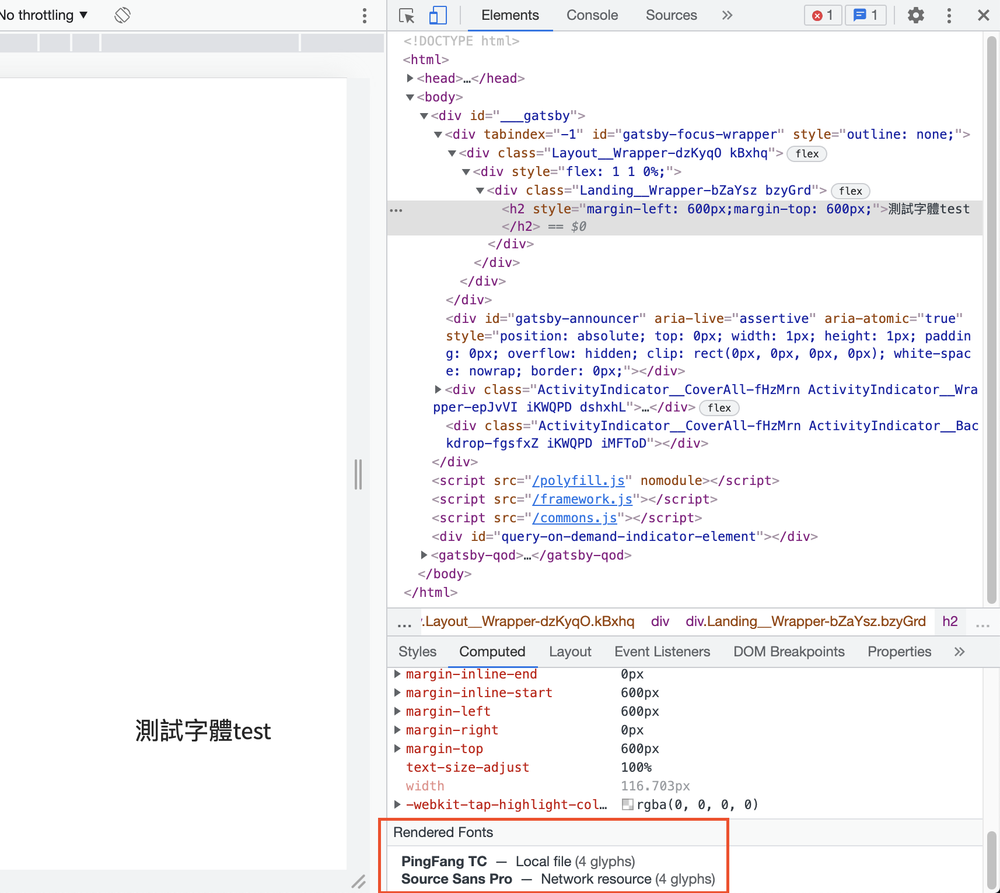

The easy ways to add font to our site / project.

### Syntax

- Family name should be quote if the name has whitespace. ex. "Source Sans Pro"
- We can put a list of font (family-name) in font-family, from highest priority to lowest.
- We should always put a generic-name at the last of the list. Since the list of the font are not available, this lets the browser select an acceptable fallback font when necessary.
    - generic-name: for preventing non of the font list is available.
        - sans-serif , serif, monospace, cursive, fantasy, system-ui, emoji, math, fangsong
        - demo example: [https://developer.mozilla.org/en-US/docs/Web/CSS/font-family#examples](https://developer.mozilla.org/en-US/docs/Web/CSS/font-family#examples)

```jsx
font-family:"family name1", "family name2", ..., generic-name;

//example:
/* A font family name and a generic family name */
font-family: "Gill Sans Extrabold", sans-serif;
font-family: "Goudy Bookletter 1911", sans-serif;
```

### Use

1. CSS Link
    - source: [https://fonts.google.com/](https://fonts.google.com/), google font will give us the link.
    - paste the font source link into  `<head>` (in react project, we can use `react-helmet`)
2. @import
    - source: [https://fonts.google.com/](https://fonts.google.com/)
    - google font will give us the import code, we can directly paste in css file!
    

### Inspect

We can inspect whether the fonts apply successfully in browser inspector.



### Sources

[MDN](https://developer.mozilla.org/en-US/docs/Web/CSS/font-family)

[中文參考](https://www.oxxostudio.tw/articles/201811/css-font-family.html)